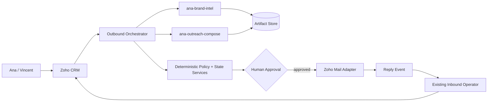
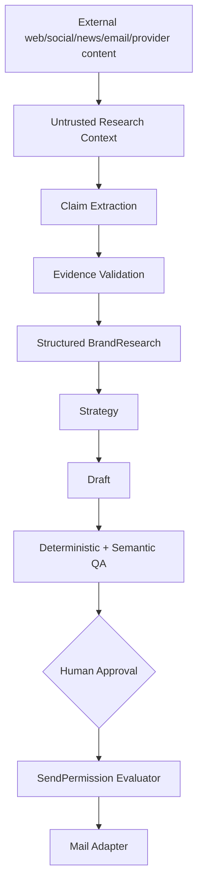

# Architecture

## Status

**Architecture baseline v1**

This document is descriptive. Normative behavior lives in `SPEC.md`.

## System intent

The Ana agent ecosystem is designed as an evidence-grounded partnership decision system with controlled communication output.

The initial use case is Brand Partnership outreach for Ana Savu.

The system must understand a Brand, establish whether a real fit exists, form a concrete collaboration hypothesis, and only then create communication.

## System context



## Generative capability layer

### ana-brand-intel

Responsibilities:

- evidence-grounded Brand research
- claim classification
- contact intelligence
- multidimensional Ana/Brand fit
- explicit counterargument
- collaboration hypothesis generation

Allowed conceptual permissions:

- SEARCH
- WEB_READ
- CRM_READ
- KNOWLEDGE_READ

Forbidden:

- CRM_WRITE
- MAIL_SEND
- policy override

### ana-outreach-compose

Responsibilities:

- outreach strategy
- approved voice/example retrieval
- evidence-grounded draft generation
- genericness checks
- semantic quality review

It must not independently browse the web.

Its inputs must already be structured and validated.

## Deterministic layer

The following are software/runtime responsibilities, not free-form LLM roles:

- schema validation
- evidence-chain validation
- commercial policy evaluation where rules are explicit
- compliance-policy interface
- lifecycle/state machine
- duplicate detection
- suppression / DNC / opt-out enforcement
- contact validation gates
- send-permission evaluation
- scheduler
- audit log
- Zoho adapters

## Canonical intermediate artifact flow

```text
LeadTriage
-> BrandResearch
-> ContactProfile
-> AnaBrandFit
-> CollaborationHypothesis
-> CommercialCheck
-> OutreachStrategy
-> EmailDraft
-> QAGateReport
-> HumanApproval
-> SendPermission
-> SendReceipt
-> ReplyHandoff
-> OutcomeRecord
```

The purpose of these intermediate artifacts is to prevent raw research, speculative reasoning, and action authority from collapsing into one model call.

## Trust boundary



**Invariant:** raw external content has no direct path to SEND.

## Knowledge model

Shared knowledge areas:

- CreatorTruthPack
- CommercialPolicy
- VoiceProfile
- ApprovedExamples
- BrandRestrictions
- OutreachOutcomeHistory

This public repository stores only schemas, public policies, examples, and synthetic fixtures. Production values belong in a protected runtime store.

## Data ownership

```text
Zoho CRM
= operational summary and lifecycle state

Artifact Store
= detailed research, evidence, intermediate artifacts, eval traces

Public Git repository
= source code, schemas, policies, documentation, synthetic fixtures
```

Do not turn Zoho CRM into a complete evidence/document database.

## Permission model

Conceptual capabilities:

- SEARCH
- READ
- DRAFT
- WRITE
- SEND
- DELETE
- CONFIGURE

### MVP

Agents may use:

- SEARCH
- READ
- DRAFT

Human authority owns:

- APPROVE
- SEND

Later autonomy may only be added through explicit policy and evaluation gates.

## Send authorization

A generative model cannot authorize sending.

A deterministic `SendPermission` must bind:

- exact draft hash
- valid approval
- contact validation
- compliance clearance
- suppression state
- duplicate state
- freshness requirements
- policy version
- expiry

Any change to the approved draft invalidates the prior approval/send permission.

## Reply handling

Any reply immediately stops queued automated follow-up.

Classification occurs after the stop action.

## Integration ports

Future adapters should be explicit interfaces for:

- Zoho CRM
- Zoho Mail
- web search
- browser/page reader
- contact verification
- model runtime
- artifact storage
- audit sink
- clock/scheduler

The domain layer should not depend directly on one LLM framework or vendor.

## Initial delivery boundary

The first useful product increment is:

```text
Brand/Lead
-> CRM Context
-> BrandResearch
-> ContactProfile
-> AnaBrandFit
-> CollaborationHypothesis
-> CommercialCheck
-> OutreachStrategy
-> EmailDraft
-> Evidence Map
-> QAGateReport
-> Human Review
```

Autonomous first-touch sending is explicitly out of scope for the initial implementation.
